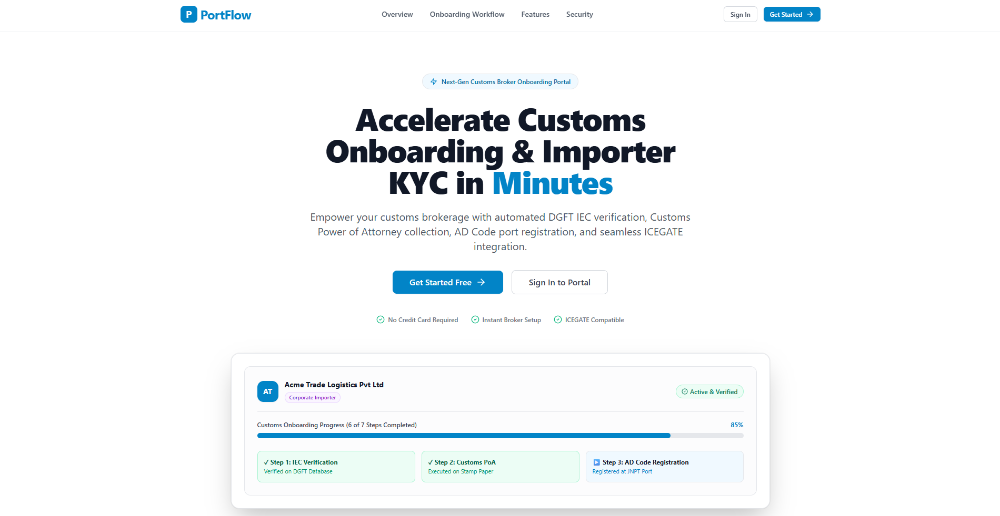
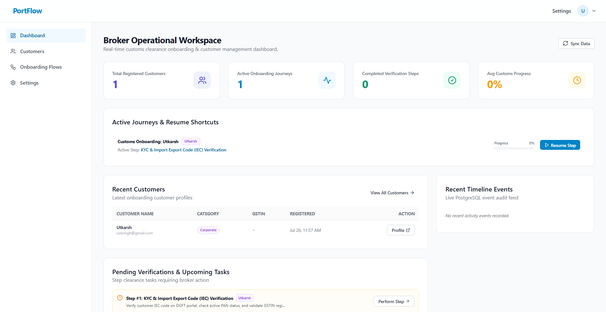
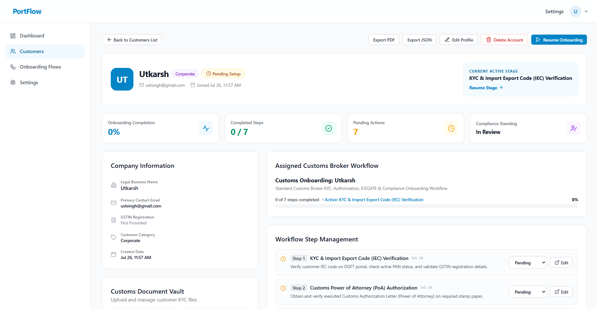
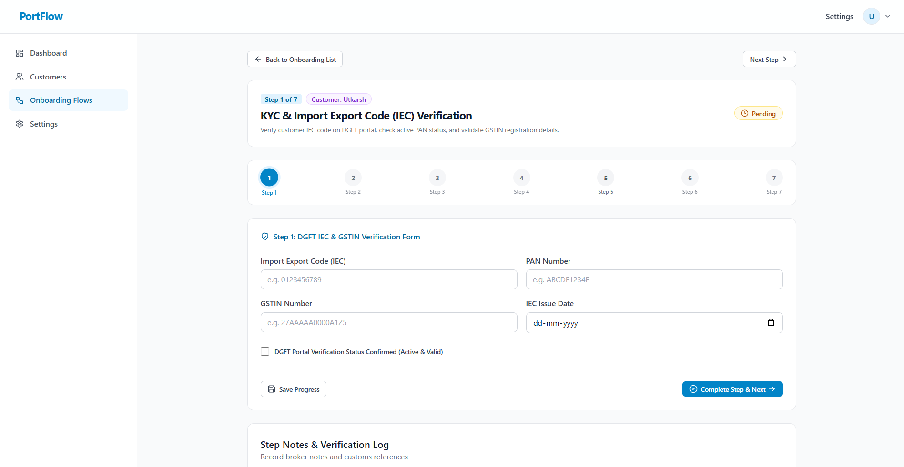

# 🚢 PortFlow

### Production-Inspired Customs Broker Onboarding Platform

> Production-inspired customs broker onboarding platform built with **FastAPI, PostgreSQL, React, TypeScript and Tailwind CSS**.

PortFlow digitizes the customs broker onboarding process by replacing manual paperwork with a secure workflow-driven platform for customer management, document verification, compliance tracking, and audit reporting.

It provides brokers with a centralized workspace to manage importer onboarding through a structured **7-step customs clearance process** while maintaining complete audit history and document storage.


---

## 📋 Submission Summary

✅ Responsive React + TypeScript frontend

✅ FastAPI REST API backend

✅ PostgreSQL database integration

✅ JWT Authentication & Authorization

✅ Complete 7-Step Customs Broker Onboarding Workflow

✅ Customer Management Dashboard

✅ Document Upload & Management

✅ Audit Activity Timeline

✅ PDF Report Export

✅ JSON Data Export

✅ Mobile Responsive UI

---

## 🎥 Demo

> A walkthrough of the complete customs broker onboarding workflow.

<p align="center">
  
</p>

> **Note**
>
> This project is designed to run locally because it depends on a FastAPI backend,
> PostgreSQL database, JWT authentication, and secure file uploads.
> Instead of deploying an incomplete cloud version, I have included a complete
> demo GIF showcasing all implemented features and workflows.

---

## 📸 Screenshots

### Landing Page



### Dashboard



### Customer Profile



### Onboarding Workflow



---

## 📚 Table of Contents

- [Project Overview](#project-overview)
- [Key Features](#key-features)
- [Tech Stack](#tech-stack)
- [Architecture](#architecture)
- [Folder Structure](#folder-structure)
- [Installation & Setup](#installation--setup)
- [Environment Variables](#environment-variables)
- [Authentication & Authorization](#authentication--authorization)
- [Database Schema & Migrations](#database-schema--migrations)
- [API Endpoints](#api-endpoints)
- [Security Considerations](#security-considerations)
- [Report Exports (PDF & JSON)](#report-exports-pdf--json)
- [Future Improvements](#future-improvements)

---

## Project Overview

Customs brokers handle multiple regulatory and compliance steps before an importer can begin international trade. These activities typically involve document verification, workflow tracking, compliance approvals, and audit reporting.

**PortFlow** streamlines this process by providing a centralized digital workspace where brokers can manage customers, monitor onboarding progress, securely store compliance documents, generate reports, and maintain a complete audit trail throughout the customs onboarding lifecycle.

---

## Key Features

1. **Broker Authentication & Security**:
   - Secure broker registration and login with bcrypt password hashing.
   - Stateless JWT authentication for secure API access.
   - Protected frontend routes using React Router.
   - Broker-level data isolation ensuring brokers only manage their assigned customers.

2. **Interactive 7-Step Customs Onboarding Wizard**:
   - **Step 1**: DGFT Import Export Code (IEC) & GSTIN Verification.
   - **Step 2**: Customs Power of Attorney (PoA) Authorization.
   - **Step 3**: Step 3: AD Code & Port Registration.
   - **Step 4**: KYC Document Vault Verification.
   - **Step 5**: Step 5: ICEGATE Registration & DSC Details.
   - **Step 6**: Duty Deferment Facility & Export License Setup.
   - **Step 7**: Compliance Audit Sign-off & Final Account Activation.

3. **Production Document Management Vault**:
   - Upload, preview, replace, download, and delete required customs documents (GST Certificate, IEC Certificate, PAN Card, Power of Attorney, Cancelled Cheque, Address Proof).
   - Saved securely with disk storage and metadata linked in PostgreSQL.

4. **Real Audit Activity System**:
   - Automatically logs events (`customer_created`, `customer_updated`, `step_completed`, `document_uploaded`, `document_deleted`) in PostgreSQL.
   - Reverse chronological activity feed.

5. **Operational Broker Workspace Dashboard**:
   - Dashboard metrics (Total Customers, Active Journeys, Completed Verification Steps, Average Progress %).
   - 1-click **Resume Onboarding** shortcuts for active customer flows.
   - Recent customer tables, pending verification queues, and audit feeds.

6. **Multi-Format Report Exports (PDF & JSON)**:
   - **Printable PDF Audit Report**: Formatted multi-page print view with company profile, progress gauge, 7-step status breakdown, document vault summary, and timeline audit log.
   - **Structured JSON Export**: Export complete customer onboarding data for integration with external ERP/CRM systems.

7. **Responsive User Experience**:
   - Responsive interface for desktop, tablet, and mobile devices.
   - Clean dashboard for brokers with intuitive navigation.
   - Landing page showcasing platform capabilities and workflow.

---

## Tech Stack

| Category | Technology |
|-----------|------------|
| Frontend | React 18, TypeScript, Vite |
| Styling | Tailwind CSS |
| Backend | FastAPI |
| Database | PostgreSQL |
| ORM | SQLAlchemy 2.0 |
| Authentication | JWT, Passlib (bcrypt) |
| Validation | Pydantic |
| Database Migration | Alembic |
| File Upload | FastAPI UploadFile |
| API Communication | Axios |
| Icons | Lucide React |

---

## Architecture

PortFlow follows a decoupled Client-Server REST API architecture:

```
┌─────────────────────────────────────────────────────────────┐
│                      React 18 Frontend                      │
│      (Vite + TypeScript + Tailwind CSS + Lucide Icons)       │
└──────────────────────────────┬──────────────────────────────┘
                               │ HTTP REST / JSON / Multi-Part
                               ▼
┌─────────────────────────────────────────────────────────────┐
│                     FastAPI Backend API                     │
│         (JWT Auth + CORS Middleware + Dependency Inject)     │
└──────────────┬──────────────────────────────┬───────────────┘
               │ Async ORM                    │ Disk Storage
               ▼                              ▼
┌──────────────────────────────┐ ┌───────────────────────────┐
│     PostgreSQL Database      │ │ Uploads Directory         │
│ (Customers, Flows, Documents)│ │ (backend/uploads/docs)   │
└──────────────────────────────┘ └───────────────────────────┘
```

---

## Folder Structure

```
PortFlow/
├── backend/
│   ├── alembic/                      # Alembic database migrations
│   ├── app/
│   │   ├── api/v1/
│   │   │   ├── endpoints/            # Auth, Customers, Onboarding, Documents, Users
│   │   │   ├── deps.py               # JWT dependency injection & auth guard
│   │   │   └── router.py             # API Router aggregator
│   │   ├── core/                     # Config, Security, Exception handlers
│   │   ├── database/                 # Async Engine & Session management
│   │   ├── models/                   # SQLAlchemy models (User, Customer, Flow, Step, Document, Activity)
│   │   ├── schemas/                  # Pydantic validation schemas
│   │   ├── services/                 # Business logic & Database services
│   │   └── main.py                   # FastAPI application factory
│   ├── uploads/documents/            # Physical document storage directory
│   └── requirements.txt
│
└── frontend/
    ├── src/
    │   ├── components/               # Common UI, Auth, Customers, Onboarding, Documents
    │   ├── context/                  # AuthContext & State management
    │   ├── hooks/                    # Custom hooks (useAuth)
    │   ├── pages/                    # Landing, Auth, Dashboard, Customers, Onboarding
    │   ├── services/                 # API Clients (auth, customer, onboarding, document)
    │   ├── types/                    # TypeScript type definitions
    │   ├── utils/                    # Export utilities (PDF & JSON generators)
    │   ├── App.tsx                   # Main React router
    │   └── index.css                 # Global CSS tokens & styles
    ├── package.json
    └── vite.config.ts
```

---

## Installation & Setup

### Prerequisites
- Node.js (v18+)
- Python (v3.11+)
- PostgreSQL (v14+)

### 1. Backend Setup

```bash
# Navigate to backend directory
cd backend

# Create virtual environment
python -m venv venv
source venv/bin/activate  # On Windows: venv\Scripts\activate

# Install dependencies
pip install -r requirements.txt

# Run Alembic Database Migrations
alembic upgrade head

# Start FastAPI Dev Server
uvicorn app.main:app --reload --port 8000
```

### 2. Frontend Setup

```bash
# Navigate to frontend directory
cd frontend

# Install dependencies
npm install

# Start Vite Development Server
npm run dev
```

The application will be accessible at: `http://localhost:5173`.

---

## Environment Variables

Create the following environment files before running the application.

### Backend (`backend/.env`)

```env
PROJECT_NAME=<project_name>
SECRET_KEY=<jwt_secret>
DATABASE_URL=<postgres_connection_string>
ACCESS_TOKEN_EXPIRE_MINUTES=<expiry_minutes>
CORS_ORIGINS=<frontend_origin>
```

### Frontend (`frontend/.env`)

```env
VITE_API_BASE_URL=http://localhost:8000/api/v1
```

---

## Authentication & Authorization

- **Broker Registration & Login** using secure password hashing.
- **JWT-based Authentication** for protected API access.
- **Protected Client Routes** using React Router authentication guards.
- **Role-based Data Isolation** ensuring brokers only access their own customers.
- **Password Security** implemented using Passlib (bcrypt).

---

## Database Schema & Migrations

PortFlow uses **PostgreSQL** with **Alembic** for database version control and **SQLAlchemy ORM** for data modeling.

### Core Entities

- **Users** – Customs broker accounts and authentication.
- **Customers** – Importer/Exporter profiles managed by brokers.
- **Onboarding Flows** – Tracks each customer's onboarding journey.
- **Workflow Steps** – Stores progress and form data for each onboarding stage.
- **Documents** – Secure storage of uploaded compliance documents.
- **Activity Logs** – Audit trail of important system events.

Database schema changes are managed through Alembic migrations to ensure consistent deployments.

---

## API Endpoints

| Module | Functionality |
|---------|---------------|
| Authentication | Broker Registration & Login |
| Customers | Create, Update, Delete, View Customer Profiles |
| Onboarding | Retrieve Workflow, Update Step Data, Resume Progress |
| Documents | Upload, Download & Manage Customer Documents |
| Activity | Recent Timeline & Audit Logs |
| Reports | Export PDF & JSON Reports |

---

## Security Considerations

- JWT-based authentication for secure API access.
- Password hashing using **bcrypt (Passlib)**.
- Input validation using **Pydantic** models.
- SQL injection protection through **SQLAlchemy ORM**.
- Restricted CORS configuration.
- Secure file upload handling.
- Broker-level data isolation ensuring users access only their own customers.
  
---

## Report Exports

PortFlow supports exporting onboarding information in multiple formats.

### PDF Export

- Customer profile summary
- Workflow progress
- Verification status
- Uploaded documents
- Activity timeline

### JSON Export

- Complete customer profile
- Workflow data
- Document metadata
- Audit activity records

---

## Future Improvements

- Real-time DGFT & ICEGATE integrations
- OCR-based document verification
- Email notifications & workflow reminders
- Multi-user organization support
- Analytics & reporting dashboard
- Cloud storage for uploaded documents
